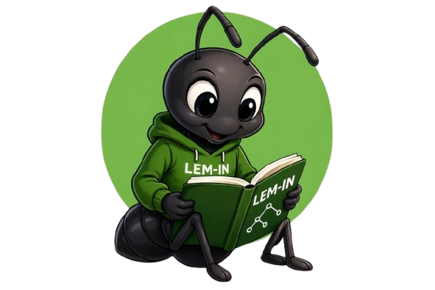

# Lem-In - Simulateur de Fourmilière


Un simulateur de fourmilière en Go qui trouve les chemins optimaux pour transporter des fourmis d'une pièce de départ à une pièce de destination via un réseau de tunnels.

Depot GitHub : https://github.com/sebastien1000/lem-in

## 📋 Vue d'ensemble

**Objectif :** Créer un programme appelé `lem-in` qui lit un fichier de configuration décrivant une fourmilière et simule le déplacement des fourmis du point de départ (`##start`) au point d'arrivée (`##end`) en empruntant les chemins les plus efficaces.


Le programme utilise un algorithme de recherche de chemins (DFS) pour explorer tous les itinéraires possibles et sélectionne les meilleurs chemins non-croisants afin de minimiser le nombre de coups nécessaires.

## 🚀 Démarrage rapide

### Prérequis
- Go 1.25.3 ou supérieur

### Installation

```GIT
git clone https://github.com/sebastien1000/lem-in.git
```

### Utilisation

Exécuter le programme avec un fichier de configuration :
```bash
cd ~/lem-in/cmd/app
go run . example00.txt
```

Lancer tous les tests automatiquement :
```bash
cd ~/lem-in
./run_tests.sh
```

## 📁 Structure du projet

```
lem-in/
├── cmd/app/                 # Point d'entrée de l'application
│   └── main.go
├── internal/
│   ├── config/             # Configuration globale
│   │   └── globals.go
│   └── models/             # Structures de données
│       └── struct.go
├── pkg/
│   ├── graph/              # Gestion du graphe
│   │   └── graph.go
│   ├── parses/             # Parsage des données
│   │   ├── parseLink.go
│   │   ├── parseRooms.go
│   │   └── dataParses/     # Validation des données
│   │       ├── checkAnts.go
│   │       ├── checkLinks.go
│   │       ├── checkRooms.go
│   │       ├── checkStartEndRoom.go
│   │       ├── ckeckData.go
│   │       └── dataParses.go
│   ├── simulation/         # Simulation des fourmis
│   │   └── ants.go
│   ├── utils/              # Utilitaires
│   │   ├── array.go
│   │   ├── documentProcessing.go
│   │   └── howManyEnd.go
│   └── way/                # Sélection des chemins
│       └── way.go
├── web/                    # images
|   └── asset/
|       ├── lem_in_zone01_schema.gif
|       └── way.go
├── tests/                  # Fichiers de test
└── go.mod
```

## 📝 Format du fichier d'entrée

Le fichier doit respecter le format suivant :

```
number_of_ants
##start
room_name x y
room_name x y
##end
room_name x y
link1-link2
link3-link4
...
```

### Exemple :
```
3
##start
0 0 0
1 4 2
2 2 4
##end
3 4 0
0-1
0-2
2-3
1-3
```

### Règles des rooms :
- ✅ Peuvent contenir des lettres, chiffres et tirets
- ❌ Ne doivent pas commencer par `#`
- ❌ Ne doivent pas contenir d'espaces
- Chaque pièce peut contenir **une seule fourmi** (sauf `##start` et `##end` qui peuvent en contenir plusieurs)
- Les coordonnées `x` et `y` doivent être des entiers valides

### Règles des tunnels (liens) :
- Chaque tunnel ne peut être utilisé **qu'une seule fois par étape**
- Relie exactement **deux rooms**
- Deux rooms ne peuvent être reliées par **plus d'un tunnel**
- Une room peut être reliée à **plusieurs autres rooms**

## 📊 Format de sortie

Le programme affiche :
1. Le fichier d'entrée original
2. Les mouvements des fourmis à chaque étape

```
L1-1 L2-2 L3-3
L1-2 L2-3
L1-3
```

Où :
- `Lx-y` signifie "la fourmi numéro x se déplace vers la pièce y"
- Les fourmis sont numérotées de 1 à n

## ❌ Gestion des erreurs

Le programme affiche le message d'erreur suivant en cas de données invalides :

```
ERROR: invalid data format.
```

Les cas d'erreur incluent :
- Nombre de fourmis incorrect ou invalide
- Pièces manquantes, en double, ou mal formatées
- Absence de `##start` ou `##end`
- Plusieurs `##start` ou `##end`
- Liens vers des pièces inconnues
- Coordonnées invalides
- Entrées mal formatées

## 🔧 Fonctionnalités principales

### 1. **Parsage et validation des données**
- Validation du format du fichier
- Vérification de l'intégrité des données
- Détection des erreurs

### 2. **Construction du graphe**
- Représentation des pièces comme nœuds
- Représentation des tunnels comme arêtes
- Support des graphes bidirectionnels

### 3. **Recherche de chemins**
- Algorithme DFS (Depth-First Search) pour explorer tous les chemins possibles
- Sélection des chemins optimaux non-croisants
- Minimisation du nombre de coups nécessaires

### 4. **Simulation des fourmis**
- Déplacement étape par étape
- Gestion des collisions
- Respect des contraintes des tunnels

## 🧪 Tests

Le projet inclut plusieurs fichiers de test :
- `example00.txt` à `example06.txt` : Cas de base
- `badexample00.txt`, `badexample01.txt` : Cas d'erreur
- `test0.txt` à `test3.txt` : Tests supplémentaires

Pour exécuter tous les tests :
```bash
./run_tests.sh
```

## 💡 Algorithme de résolution

1. **Parsage** : Lecture et validation du fichier
2. **Construction du graphe** : Création de la structure de données
3. **Recherche de chemins** : Utilisation du DFS pour trouver tous les chemins possibles
4. **Sélection optimale** : Choix des chemins non-croisants minimisant le nombre de coups
5. **Simulation** : Déplacement des fourmis étape par étape
6. **Affichage** : Sortie des mouvements

## 👨‍💻 Auteur

Développé en Go comme projet d'apprentissage d'algorithmique et de programmation impérative.

## 📚 Notes supplémentaires

> Le chemin le plus court n'est pas forcément le plus simple. Plusieurs chemins optimaux peuvent coexister, et le programme sélectionne le meilleur ensemble de chemins non-croisants.


- [x] Pour arriver les premières fourmis devront emprunter le ou les chemins les plus courts. Elles devront également éviter les embouteillages et ne pas marcher sur leurs congénères.

- [x] Vous n'afficherez que les fourmis qui se sont déplacées à chaque tour, et vous ne pouvez déplacer chaque fourmi qu'une seule fois et à travers un tunnel (la pièce à l'extrémité de réception doit être vide).

> Les noms des pièces ne seront pas nécessairement des numéros, et ils seront classés par ordre.

- [x] Toute commande inconnue sera ignorée.

- [x] Le programme doit gérer les erreurs avec soin. Il ne doit en aucun cas s'arrêter de manière inattendue.

- [x] Les coordonnées des pièces seront toujours int.


### Algorithme
Lem-In Go utilise une **combinaison d'algorithmes de parcours de graphes et d'heuristiques** pour trouver le chemin optimal pour les fourmis. Les principales étapes de l'algorithme sont les suivantes :

Analyse des données d'entrée pour créer une représentation graphique du labyrinthe.
Appliquer des algorithmes de parcours de graphes (par exemple, l'algorithme de Dijkstra: https://en.wikipedia.org/wiki/Dijkstra%27s_algorithm ) pour trouver les chemins les plus courts entre la pièce de départ et la pièce d'arrivée. Voir plus :https://medium.com/@jamierobertdawson/lem-in-finding-all-the-paths-and-deciding-which-are-worth-it-2503dffb893
Répartir les fourmis le long des chemins tout en évitant les collisions.
